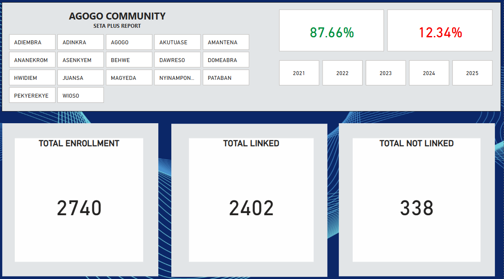

# SETA-TyVEGHA Integration Project (Typhoid Surveillance & Tracking)

This repository documents the data integration and surveillance efforts for typhoid fever in Ghana, through the combination of two major projects: **SETA Plus (Severe Typhoid in Africa)** and **TyVEGHA (Typhoid Conjugate Vaccine Effectiveness in Ghana)**.

## 🦠 Project Background

**Typhoid fever** is a serious infectious disease caused by *Salmonella Typhi*, typically transmitted through contaminated food or drinking water. It is prevalent in countries with limited access to clean water and sanitation, including Ghana. Children are at higher risk, and while early treatment can prevent complications, **antimicrobial resistance** is making the disease harder to treat.

To mitigate this, **vaccination** is increasingly critical. The SETA Plus project, led by the **International Vaccine Institute (Seoul, Korea)** in collaboration with **Kwame Nkrumah University of Science and Technology (KNUST, Kumasi, Ghana)**, aims to estimate the disease burden and evaluate vaccine effectiveness through detailed surveillance and data analysis.

## 🔍 Purpose

The goal of this project is to:
- Estimate the burden of typhoid in the Asante Akim North District.
- Evaluate the effectiveness of typhoid conjugate vaccines.
- Improve disease tracking by linking clinical data with household census data.
- Support national and global vaccine policy decision-making.

## 🧩 Project Integration

This is a **combined project** integrating:

- **SETA**: Surveillance of typhoid patients who present with fever at hospital facilities.
- **TyVEGHA**: A baseline census exercise to collect demographic information and generate unique **TyVEGHA IDs** for tracking participants.

When a participant presents with a fever (temperature >= 37.0°C), they are enrolled in SETA. If their **TyVEGHA ID** is available, the participant is linked back to their household and demographic details. This creates a bridge between clinical and community data, enabling effective tracking and spatial analysis.

## 🧠 How It Works

1. **Census Exercise (TyVEGHA)**  
   - Communities and towns in the **Asante Akim North District** are divided into **Enumeration Areas (EAs)**.  
   - Enumerators visit each structure/house to collect demographic information: name, age, sex, head of household, etc.  
   - A unique **TyVEGHA ID** is generated for every individual.

2. **Clinical Enrollment (SETA)**  
   - Participants with a history of fever (> 36.9°C) are enrolled in SETA at the hospital.  
   - The participant is then **linked to their TyVEGHA ID** (if available).

3. **Data Linking and Tracking**  
   - This linkage enables researchers to trace the participant back to their home and community.  
   - Town-level analysis identifies areas with low linkage rates or underrepresentation.  
   - Insights are used to improve follow-up, redistribute resources, and improve future census exercises.

## 📊 Outcomes and Impact

- **Improved Surveillance:** Accurate mapping of participants helps understand regional disease spread.
- **Targeted Follow-ups:** Identifying towns with many enrollments but few linkages enables focused census efforts.
- **Data-Driven Interventions:** Informs policy and public health strategies at local and national levels.
- **Confidentiality:** All participant data is anonymized using unique IDs, ensuring privacy and compliance.

## 🔐 Data Privacy

All collected data is strictly confidential. Identifying information is replaced with study-specific IDs during analysis to ensure participant privacy and data protection.

---

### 🧾 Acknowledgements

This project is a collaboration between:
- International Vaccine Institute (IVI)
- Kwame Nkrumah University of Science and Technology (KNUST)
- Local health authorities in Asante Akim North District

---

📸 Dashboard Screenshots by Town
Below are visual insights from the monitoring dashboard, showing enrollment and linkage data for each town in the Asante Akim North District:

🔹 Agogo

🔹 Ananekrom

🔹 Pekyerekye

🔹 Nyinamponase

🔹 Behwe

🔹 Dawreso

🔹 Amantena

🔹 Akutuase

🔹 Wioso

🔹 Juansa

🔹 Domeabra

🔹 Magyeda

🔹 Pataban

🔹 Adinkra

🔹 Adiemra

🔹 Hwidiem

🔹 Asenkyem

📌 **Note:** This repository may contain documentation, analysis scripts, visualizations, and tools for managing and analyzing the linkage between SETA and TyVEGHA data. No personal identifying data is included.

